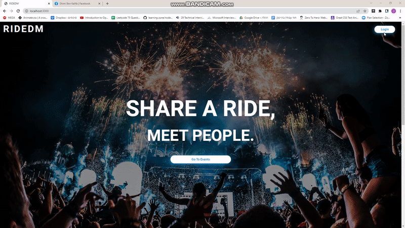
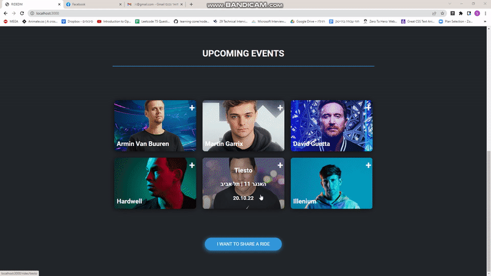
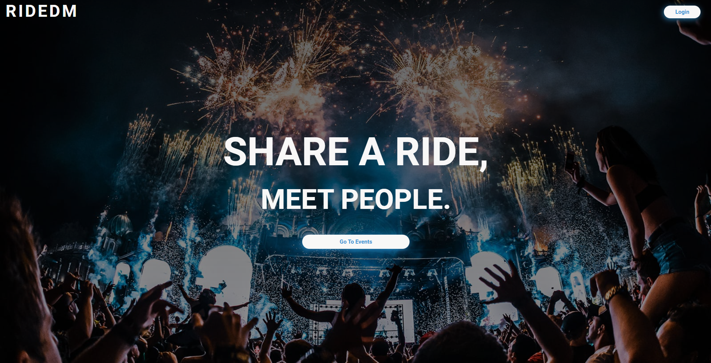
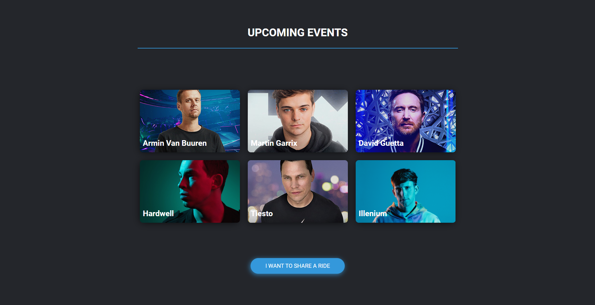
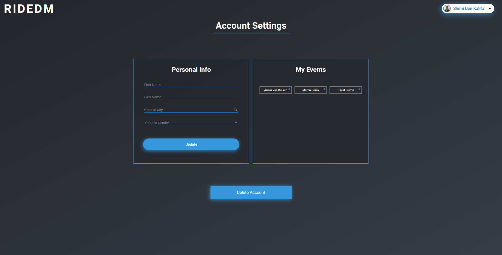

## Project Name & Pitch

RIDEDM

A Web Application that connects people by by allowing them to find and share rides for Electronic Dance Music (EDM) Events , built with Mongo, Express, React and Nodes.js.

## Project Status

Users can find and Share rides, Follow Events and get notified by an email when a ride from their defined hometown is uploaded,  users can also edit and delete rides they uploaded.

Currently In Development : 

1)Admin Panel
 
2)Full Responsiveness
 
3) Error Handling
 
4) Deployment

## Project Screen Shot(s)
 

 

 

 

 

 

 

## Installation and Setup Instructions

#### Example:  

Clone down this repository. You will need `node` and `npm` installed globally on your machine.  

Installation:

`npm install`  

To Start Server:

`npm start`  

To Start Client:

`npm start`

To Visit App:

`localhost:3000`  

## Reflection

This project idea was conveived a few months back and was developed at the same time as my academic studies. Project goals included learning MERN technologies , and bringing this idea to life which will connect and help people out. 

As a member of the biggest EDM community on facebook , I always see that people are looking for a ride by posting it to the group , which leaves their chance to find a ride to the grace of facebook's algorithms , which is known for low reach , so I decided to build a platform that ensures they wont miss any possible ride.

Building this project has made me ran into alot of challenges since it is my first real world project that is not a mockup one , challenges like third party authentication combined with the needd to save the information to Mongo , designing with css and more , challanges that lead me to spend days and night in resarching and fixing bugs. 

All in all it was ( and still ) a fun project to develop , hoping that soon it will be published.
