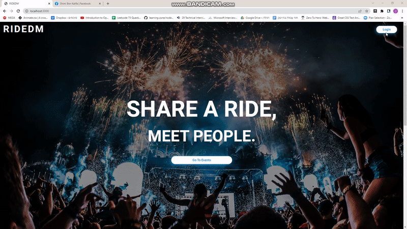
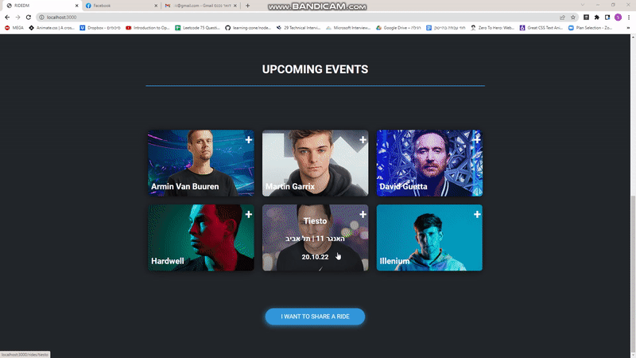
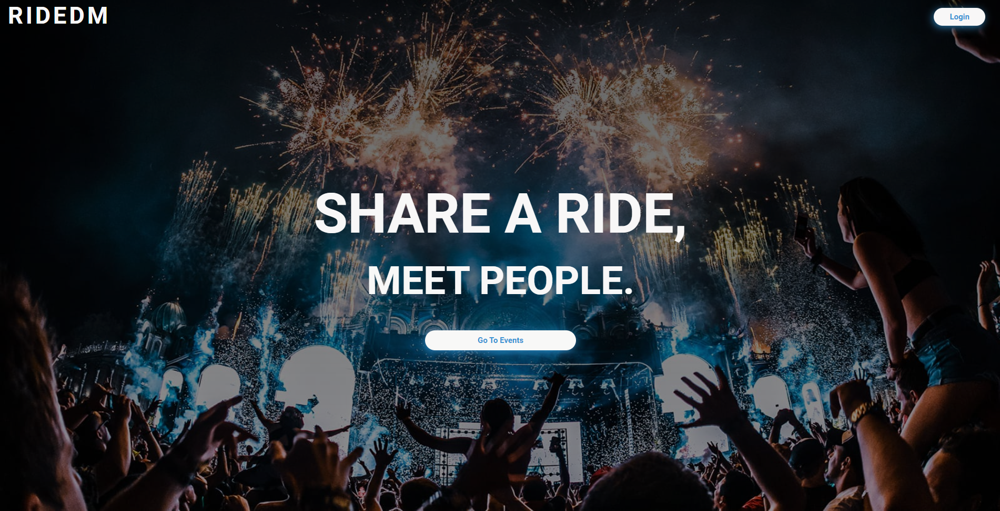
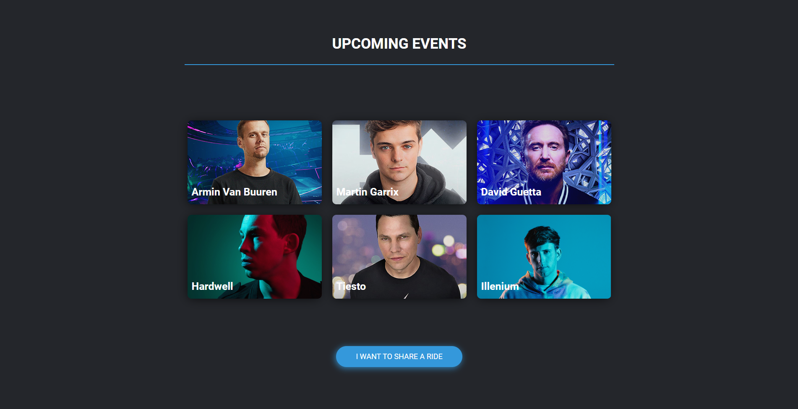
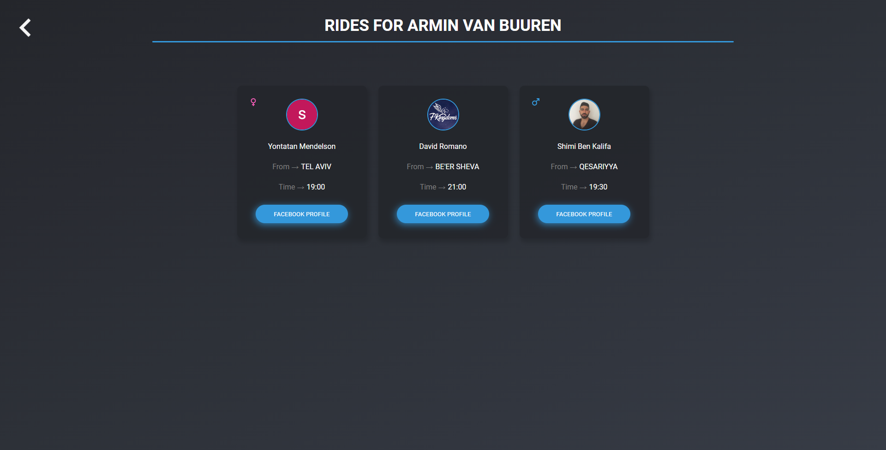
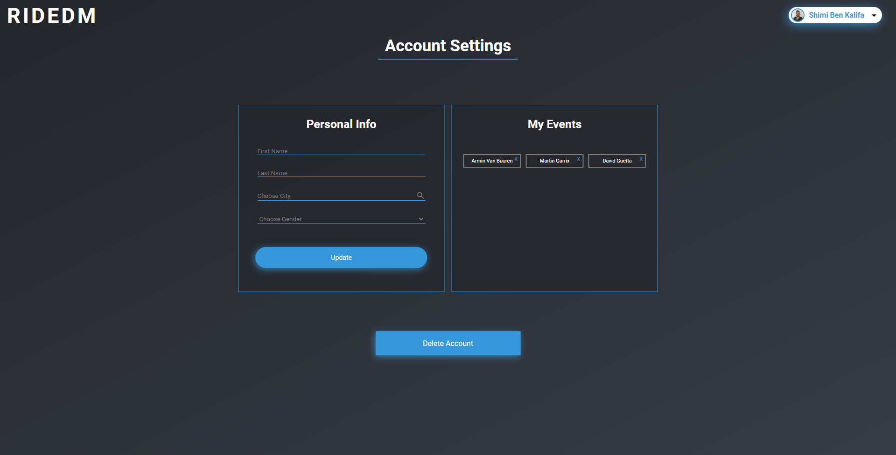
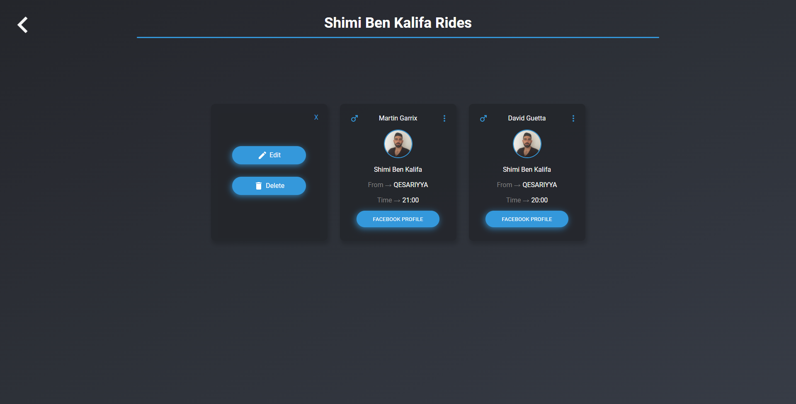
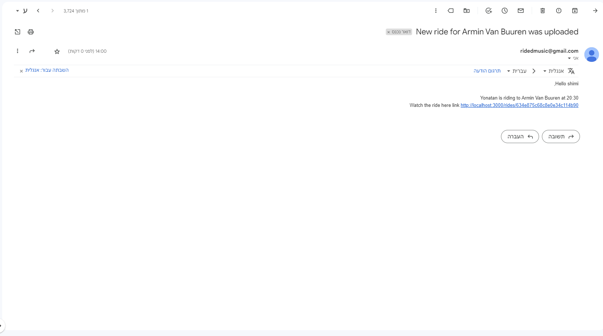

## Project Name & Pitch

RIDEDM

A Web Application that connects people by by allowing them to find and share rides for Electronic Dance Music (EDM) Events , built with Mongo, Express, React and Nodes.js.

## Project Status

Users can find and Share rides, Follow Events and get notified by an email when a ride from their defined hometown is uploaded,  users can also edit and delete rides they uploaded.

Currently In Development : 

1)Admin Panel
 
2)Full Responsiveness
 
3) Error Handling
 
4) Deployment

## Project Screen Shot(s)
 

 
 
 
 

 
 
 
 

 
 
 
 

 
 
 
 

 
 
 
 

 
 
 
 

 
 
 
 

## Installation and Setup Instructions

Clone down this repository. You will need `node` and `npm` installed globally on your machine.  

Installation:

`npm install`  

To Start Server:

`npm start`  

To Start Client:

`npm start`

To Visit App:

`localhost:3000`  

## Reflection

This project idea was conceived a few months back and was developed at the same time as my academic studies. Project goals included learning MERN technologies and bringing this idea to life, which could connect and help people out.

As a member of the most prominent Israeli EDM community on Facebook, I have noticed that members are looking for a ride by Facebook posts, which leaves their chance to find one to the grace of Facebook's algorithms, which is known for low reach, so I decided to build a platform that ensures they won't miss any possible ride.

Building this project has made me run into a lot of challenges since it is my first real-world project that is not a clone of an existing web app, challenges like third-party authentication combined with the need to collect certain information to the DB, designing with CSS and more, challenges that lead me to spend days and nights in research,   and fixing bugs. 

On the whole, it was (and still is) a fun project to develop, and hopefully soon to be published.
